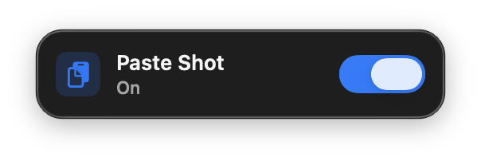

<div align="center">

# Paste Shot

**Copy each macOS screenshot to the clipboard. ⌘V pastes the PNG.**

Menu extra for macOS 14+. Lives on the **right** of the menu bar. No Dock icon.

<br/>

[](https://github.com/BadryansahBangsawan/paste-shot/actions/workflows/ci.yml)
[](https://github.com/BadryansahBangsawan/paste-shot/releases/latest)
[](https://github.com/BadryansahBangsawan/paste-shot/releases/latest)

<br/>



| | |
|---|---|
| Product | `PasteShot` |
| Bundle ID | `engineer.badry.pasteshot` |
| Cask | `paste-shot` |
| Status item | SF Symbol `doc.on.clipboard` (`Paste Shot` / `Copied` / `Off`) |
| Panel | Control Center–style On/Off card |

</div>

---

## What you get

| Piece | Behavior |
|---|---|
| **Watch** | Folder from `com.apple.screencapture` `location`, else Desktop. Not Screen Recording. |
| **Clipboard** | PNG + TIFF. No `text/plain`, so a browser that prefers text still gets the image. |
| **Cleanup** | Original screenshot is deleted after copy. A copy stays at `~/Library/Application Support/PasteShot/last.png`. |
| **Filter** | Only files Spotlight marks as screen captures, or names starting `Screenshot `, `Screen Shot `, or `Tangkapan Layar `. Random PNGs are ignored. |
| **Types** | png, jpg, jpeg, heic, tif, tiff, pdf |
| **Login** | Registers Open at Login on first launch (`SMAppService`). |

---

## Download

Same GitHub Release, two files:

| File | Use |
|---|---|
| **`PasteShot-*-.dmg`** | Open, drag **PasteShot** onto **Applications** |
| **`PasteShot.app.zip`** | Homebrew cask / unzip |

**[Releases](https://github.com/BadryansahBangsawan/paste-shot/releases/latest)**

---

## Install

### Disk image

1. Download `PasteShot-*-.dmg` from [Releases](https://github.com/BadryansahBangsawan/paste-shot/releases/latest).
2. Open it. Drag **PasteShot** onto **Applications**.
3. First open (ad-hoc signed):

```bash
xattr -cr /Applications/PasteShot.app
open /Applications/PasteShot.app
```

Still blocked: System Settings → Privacy & Security → Open Anyway.

### Homebrew

```bash
brew tap BadryansahBangsawan/mac-menu-apps
brew trust BadryansahBangsawan/mac-menu-apps
brew install --cask paste-shot
```

`brew trust` is required on Homebrew 6 or `brew install --cask` refuses the tap.

Do not run `dist/PasteShot.app` while `/Applications/PasteShot.app` is running (same bundle ID).

---

## How to open

This is an `LSUIElement` extra. Proof it is running is the **clipboard** status item on the **right** of the menu bar, not a window from Finder or Launchpad.

1. Click that extra. The panel is a compact On/Off card, not a 10px strip.
2. If the bar is full, look behind the Control Center overflow chevron **«**.
3. Double-clicking in Finder/Launchpad only changes the left-side app name. That is expected. There is no Dock icon.

---

## Usage

1. Leave the switch **On** (default).
2. Press ⌘⇧3 or ⌘⇧4 (**file save**, not Control).
3. ⌘V pastes the **image** (Notes, Slack, browsers). The same bytes sit at `~/Library/Application Support/PasteShot/last.png`.
4. **Off** stops copying. The extra still sits in the menu bar and still opens at login.

A PNG dropped into the screenshot folder that is not a screenshot is ignored.

---

## Permissions

No Screen Recording. No Accessibility. Files and Folders for Desktop / Documents / Downloads is requested **once** by macOS (usage strings in `Info.plist`).

---

## Data

| What | Where |
|---|---|
| On/Off | `UserDefaults` `engineer.badry.pasteshot.enabled` |
| Open at Login | `SMAppService.mainApp` (registered on launch) |
| Screenshot folder grant | `UserDefaults` security-scoped bookmark |
| Last PNG + Terminal path | `~/Library/Application Support/PasteShot/last.png` |
| Original screenshot | Deleted after copy |

The app does not crash if the screenshot folder is missing; the panel shows a red **Screenshot folder missing.**

---

## Privacy

Screenshot bytes stay on this Mac (pasteboard + `last.png`). Nothing is uploaded.

---

## Uninstall

```bash
brew uninstall --cask paste-shot
```

Or delete `/Applications/PasteShot.app`. Then:

```bash
rm -rf "$HOME/Library/Application Support/PasteShot"
```

Turn off **Paste Shot** in System Settings → General → Login Items if it remains.

---

## Troubleshooting

| What you see | What to do |
|---|---|
| Finder “opens” nothing / no Dock icon | Click the **clipboard** extra on the right of the menu bar. |
| Extra missing | Overflow **«**, or `pgrep -x PasteShot` then `open /Applications/PasteShot.app`. |
| “Damaged” / cannot verify | `xattr -cr /Applications/PasteShot.app`. `spctl --assess` is `rejected` even when it runs. |
| `brew install --cask` refuses the tap | `brew trust BadryansahBangsawan/mac-menu-apps` |
| **Screenshot folder missing.** | Create the folder in Screenshot settings, or restore Desktop. |
| ⌘⇧4 did nothing | Switch **On**. Use file save, not Control. Name should start with `Screenshot `, `Screen Shot `, or `Tangkapan Layar `, or Spotlight `kMDItemIsScreenCapture`. |
| Website ⌘V pastes `'…/PasteShot/last.png'` | That page read `text/plain`. **1.0.10+** copies PNG/TIFF only. Relaunch, screenshot again. |
| Terminal ⌘V is empty | Intended. Use `~/Library/Application Support/PasteShot/last.png`, or `defaults write engineer.badry.pasteshot copyPath -bool true`. |
| Random PNG in the folder was not copied | Intended. Only screenshots are copied. |
| ~10px empty strip under the bar | Reinstall from this repo. |

---

## Build from source

```bash
git clone https://github.com/BadryansahBangsawan/paste-shot.git
cd paste-shot
swift build -c release --product PasteShot
bash package-app.sh
bash make-dmg.sh
open dist/PasteShot.app
```

Tag `v*` runs CI: `PasteShot.app.zip` + `PasteShot-<version>.dmg`. Never commit `dist/`.

Layout: `Sources/` (SwiftPM executable), `Info.plist`, `Assets/AppIcon.icns`, `package-app.sh`, `make-dmg.sh`.

---

## FAQ

**Why is there no Dock icon?**  
It is a menu extra. Click the clipboard item on the **right** of the menu bar.

**Does this need Screen Recording?**  
No. It watches the file the Screenshot UI already wrote.

**Where did my screenshot go?**  
Deleted from the screenshot folder after copy. A copy remains at `~/Library/Application Support/PasteShot/last.png`.

**Why did a website paste a file path?**  
The clipboard used to include a quoted path for Terminal. Sites that read `text/plain` first took that string. Current Paste Shot does not put a path on the clipboard.

**How do I paste the path in Terminal?**  
`~/Library/Application Support/PasteShot/last.png`. To put the quoted path on the clipboard again: `defaults write engineer.badry.pasteshot copyPath -bool true`.

**How do I stop it opening at login?**  
System Settings → General → Login Items → **Paste Shot**.

---

<div align="center">

[MIT](LICENSE)

</div>
